# OptiX Applications

Advanced Samples for the [NVIDIA OptiX 7 Ray Tracing SDK](https://developer.nvidia.com/optix)

The goal of the three initial introduction examples is to show how to port an existing OptiX application based on the previous OptiX 5 or 6 API to OptiX 7.

For that, two of the existing [OptiX Introduction Samples](https://github.com/nvpro-samples/optix_advanced_samples/tree/master/src/optixIntroduction) have been ported to the OptiX 7 SDK.

*intro_runtime* and *intro_driver* are ports from *optixIntro_07*, and *intro_denoiser* is a port of the *optixIntro_10* example showing the built-in AI denoiser.
Those are already demonstrating some advanced methods to architect renderers using OptiX 7 on the way.

If you need a basic introduction into OptiX 7 programming, please refer to the [OptiX 7 SIGGRAPH course material](https://github.com/ingowald/optix7course) first and maybe read through the [OptiX developer forum](https://forums.developer.nvidia.com/c/gaming-and-visualization-technologies/visualization/optix/167) as well for many topics about OptiX 7.

The landing page for online NVIDIA ray tracing programming guides and API reference documentation can be found here: [NVIDIA ray tracing documentation](https://raytracing-docs.nvidia.com/). This generally contains more up-to-date information compared to documents shipping with the SDKs and is easy to search including cross-reference links.

Please always read the OptiX SDK Release Notes before setting up a development environment.

# Overview

OptiX 7 applications are written using the CUDA programming APIs. There are two to choose from: The CUDA Runtime API and the CUDA Driver API.

The CUDA Runtime API is a little more high-level and usually requires a library to be shipped with the application if not linked statically, while the CUDA Driver API is more explicit and always ships with the NVIDIA display drivers. The documentation inside the CUDA API headers cross-reference the respective function names of each other API.

To demonstrate the differences, **intro_runtime** and **intro_driver** are both a port of [OptiX Introduction sample #7](https://github.com/nvpro-samples/optix_advanced_samples/tree/master/src/optixIntroduction/optixIntro_07) just using the CUDA Runtime API resp. CUDA Driver API for easy comparison.

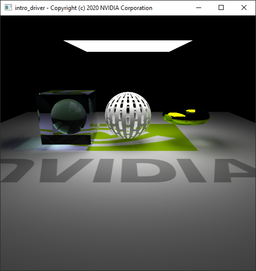

**intro_denoiser** is a port from [OptiX Introduction sample #10](https://github.com/nvpro-samples/optix_advanced_samples/tree/master/src/optixIntroduction/optixIntro_10) to OptiX 7.
That example is the same as *intro_driver* with additional code demonstrating the built-in denoiser functionality with HDR denoising on beauty and optional albedo and normal buffers, all in `float4` and `half4` format (compile time options in `config.h`).

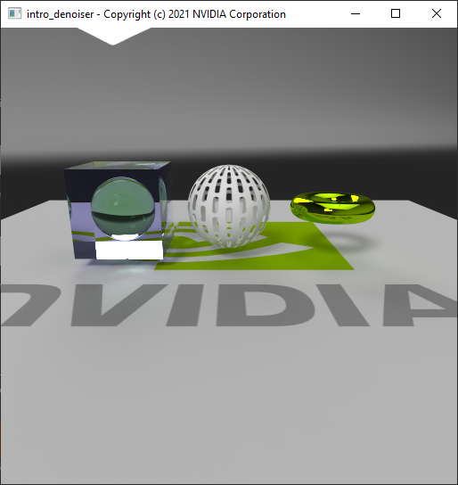

**intro_motion_blur** demonstrates how to implement motion blur with linear matrix transforms, scale-rotate-translate (SRT) motion transforms, and optional camera motion blur in an animation timeline where frame number, frames per seconds, object velocity and angular velocity of the rotating object can be changed interactively.
It's also based on *intro_driver* which makes it easy to see the code differences adding the transform and camera motion blur. 
*intro_motion_blur* will only be built when the OptiX SDK 7.2.0 or newer is found, because that version removed the `OptixBuildInputInstanceArray` `aabbs` and `numAabbs` fields which makes adding motion blur a lot simpler.

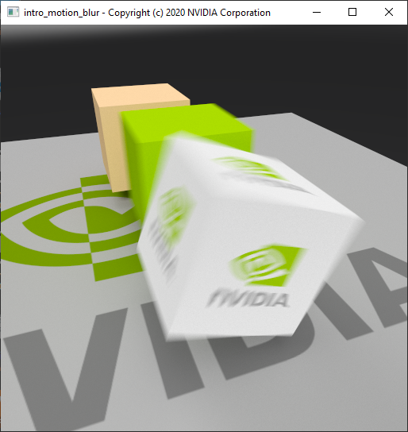

All four *intro* examples implement the exact same rendering with their scene data generated at runtime and make use of a single device (ordinal `0`) only.
(If you have multiple NVIDIA devices installed you can switch between them, by using the `CUDA_VISIBLE_DEVICES` environment variable.)

**rtigo3** is meant as a testbed for multi-GPU rendering distribution and OpenGL interoperability.
There are different multi-GPU strategies implemented (single GPU, dual GPU peer-to-peer, multi-GPU pinned memory, multi-GPU local distribution and compositing).
Then there are three different OpenGL interop modes (none, render to pixel buffer object, copy to mapped texture array).

The implementation is using the CUDA Driver API on purpose because that allows more fine grained control over CUDA contexts and devices and alleviates the need to ship a CUDA runtime library when not using the static version.

This example contains the same runtime generated geometry as the introduction examples, but also implements a simple file loader using [ASSIMP](https://github.com/assimp/assimp) for triangle mesh data.
The application operation and scene setup is controlled by two simple text files which also allows generating any scene setup complexity for tests.
It's not rendering infinitely as the introduction examples but uses a selectable number of camera samples, as well as render resolutions independent of the windows client area.

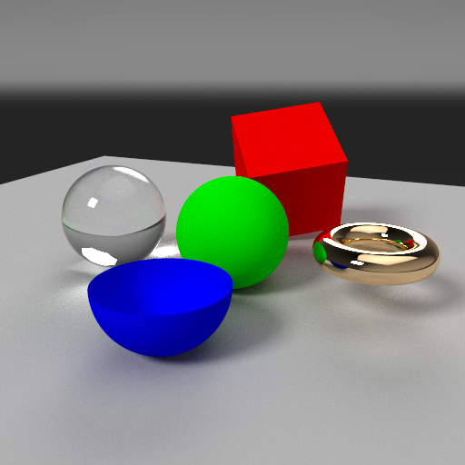

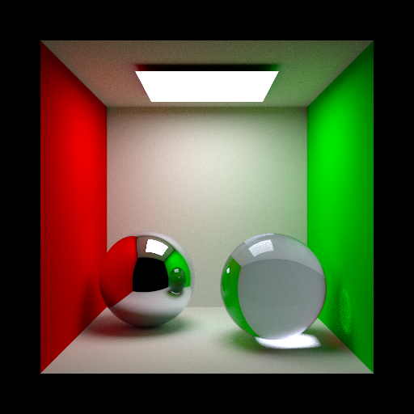

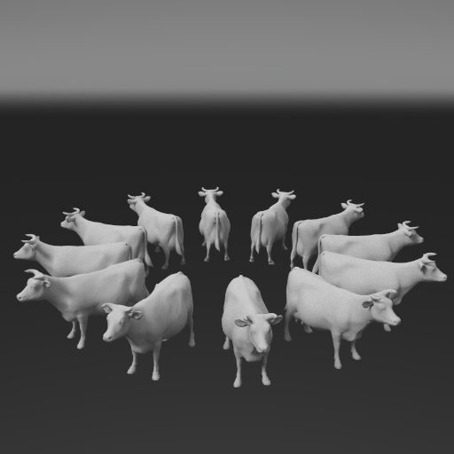

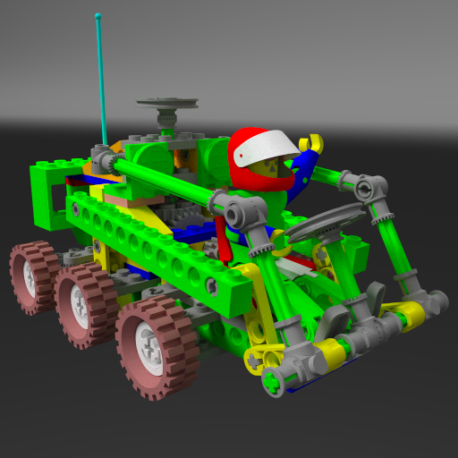

**nvlink_shared** demonstrates peer-to-peer sharing of texture data and/or geometry acceleration structures among GPU devices in an NVLINK island.
Peer-to-peer device resource sharing can effectively double the scene size loaded onto a dual-GPU NVLINK setup.
Texture sharing comes at a moderate performance cost while geometry acceleration structure and vertex attribute sharing can be considerably slower and depends on the use case, but it's reasonably fast given the bandwidth difference between NVLINK and VRAM transfers. Still a lot better than not being able to load a scene at all on a single board.

To determine the system's NVLINK topology it uses the NVIDIA Management Library [NVML](https://developer.nvidia.com/nvidia-management-library-nvml) which is loaded dynamically.
Headers for that library are shipped with the CUDA Toolkits and the library ships with the display drivers.
The implementation is prepared to fetch all NVML entry points, but currently only needs six functions for the required NVLINK queries and GPU device searches.
Note that peer-to-peer access under Windows requires Windows 10 64-bit and SLI enabled inside the NVIDIA Display Control Panel. Under Linux it should work out of the box.

This example is derived from rtigo3, but uses only one rendering strategy ("local-copy") and while it also runs on single GPU systems, the CUDA peer-to-peer sharing functionality will obviously only run on multi-GPU NVLINK systems.
The Raytracer class got more smarts over the Device class because the resource distribution decisions need to happen above the devices.
The scene description format has been slightly changed to allow different albedo and/or cutout opacity textures per material reference.
Still it's a slightly newer application architecture compared to rtigo3 when you're planning to derive own applications from these examples.

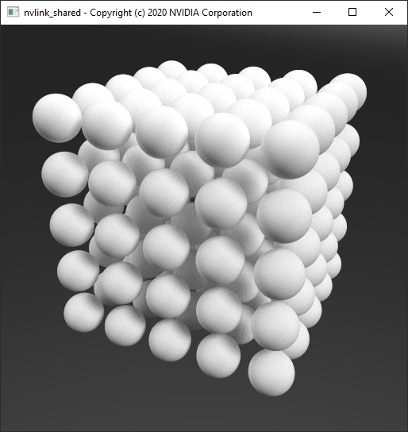

**rtigo9** is similar to nvlink_shared, but optimized for single-GPU as well to not do the compositing step unless multiple GPUs are used.
The main difference is that it shows how to implement more light types.
It's supporting the following light types:
* Constant environment light: Uniformly sampled, constant HDR color built from emission color and multiplier.
* Spherical environment map light: Importance sampled area light. Now supporting arbitrary orientations of the environment via a rotation matrix. Also supporting low dynamic range textures scaled by the emission multiplier (as in all light types).
* Point light: Singular light type with or without colored omnidirectional projection texture.
* Spot light: Singular light type with cone spread angle in range [0, 180] degrees (hemisphere) and falloff (exponent on a cosine), with or without colored projection texture limited to the sphere cap described by the cone angle.
* IES light: Singular light type (point light) with omnidirectional emission distribution defined by an IES light profile file which gets converted to a float texture on load. With or without additional colored projection texture.
* Rectangular light: Area light with constant color or importance sampled emission texture. Also supports a cutout opacity texture.
* Arbitrary triangle mesh light: Uniformly sampled light geometry, with or without emission texture. Also supports a cutout opacity texture.

To be able to define scenes with these different light types, this example's scene description file format has been enhanced.
The camera settings as well as the tone mapper settings defined inside the system description file now can be overridden inside the scene description.
The previous hardcoded light definitions inside the system description file have been removed and the scene description has been changed to allow light material definitions and creation of specific light types with these emissive materials, resp. assigning them to arbitrary triangle meshes.
Please read the `system_rtigo9_demo.txt` and `scene_rtigo9_demo.txt` files which explain the creation of all supported light types inside a single scene.

Also the previous compile time switch inside the `config.h` file to enable or disable direct lighting ("next event estimation") has been converted to a runtime switch which can be toggled inside the GUI. Note that all singular light types do not work without direct lighting enabled because they do not exist as geometry inside the scene and cannot be hit implicitly. (The probability for that is zero. Such lights do not exist in the physical world.)

Additionally to CUDA peer-to-peer data sharing via NVLINK, the rtigo9 example also allows that via PCI-E, but this is absolutely not recommended for geometry for performance reasons. Please read the explanation of the `peerToPeer` option inside the system description.

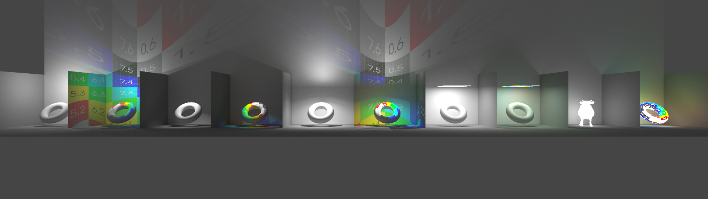

Light types shown in the image above:
The grey background is from a constant environment light. Then from left to right: point light, point light with projection texture, spot light with cone angle and falloff, spot light with projection texture, IES light, IES light with projection texture, rectangle area light, rectangle area light with importance sampled emission texture, arbitrary mesh light (cow), arbitrary mesh light with emission texture.

**rtigo9_omm** is exactly the same as rtigo9, just using the new Opacity Micromap (OMM) feature added in OptiX SDK 7.6.0.
It uses the OptiX Toolkit CUDA based OMM Baking Tool to generate OMMs from the RGBA cutout textures. The OptiX Toolkit also requires OptiX SDK 7.6.0 at this time (2023-03-30).

With OMMs, the sharing of geometry acceleration structures (GAS) among different materials is restricted for materials with cutout opacity because the OMM is part of the GAS. 
The cutout opacity value calculation has been changed from using the RGB intensity to the alpha channel because that is what the OMM Baking tool defaults to when using RGBA textures.
Another difference is that the shadow/visibility ray implementation can use a faster algorithm with `OPTIX_RAY_FLAG_TERMINATE_ON_FIRST_HIT` because fully transparent and fully opaque microtriangles of geometry with cutout opacity textures do not call into the anyhit program anymore. That also means there isn't an anyhit shadow program for geometry without cutout opacity required anymore.

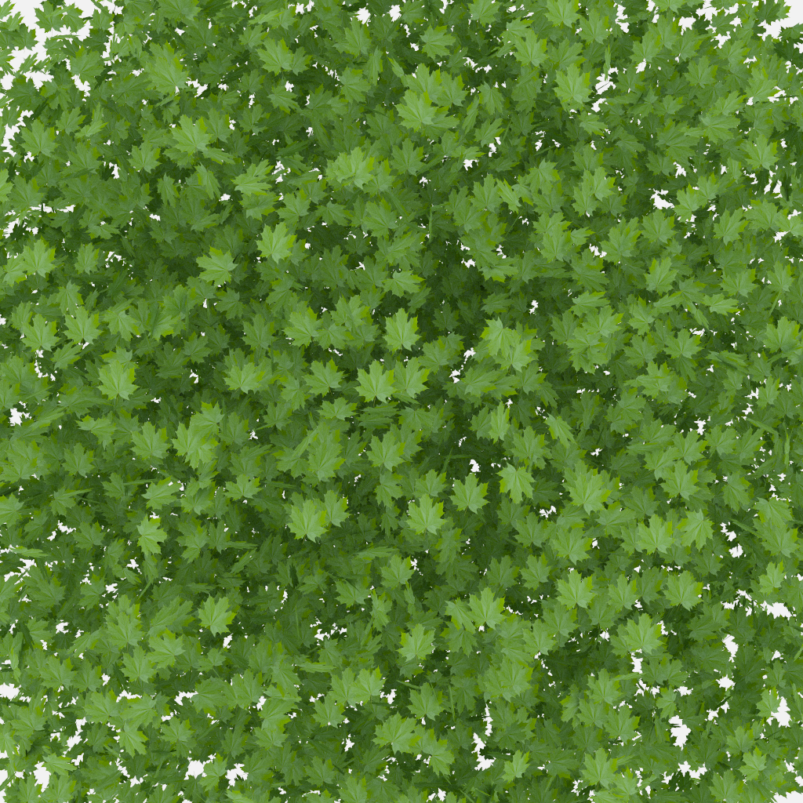

**rtigo10** is meant to show how to architect a renderer for maximum performance with the fastest possible shadow/visibility ray type implementation and the smallest possible shader binding table layout.

It's based on rtigo9 and supports the same system and scene description file format but removed support for cutout opacity and surface materials on  emissive area light geometry (arbitrary mesh lights.)
The renderer architecture implements all materials as individual closesthit programs instead of a single closesthit program and direct callable programs per material as in all previous examples above. Lens shaders and the explicit light sampling is still done with direct callable programs per light type for optimal code size.

To reduce the shader binding table size, where the previous examples used a hit record entry per instance with additional data for the geometry vertex attribute data and index data defining the mesh topology plus material and light IDs, the shader binding table in rtigo10 holds only one hit record per material shader which is selected via the instance `sbtOffset` field. All other data is indexed with via the user defined instance ID field.

On top of that, by not supporting cutout opacity there is no need for anyhit programs in the whole pipeline. The shadow/visibility test ray type is implemented with just a miss shader, which also means there is no need to store hit records for the shadow ray type inside the shader binding table at all.

**MDL_renderer** is based on rtigo9 but replaced the previously few simple hardcoded BSDFs with NVIDIA Material Definition Language (MDL) shaders.

If you're not familiar with the **NVIDIA Material Definition Language**, please find the [MDL Introduction, Handbook, and Language Specifications](https://raytracing-docs.nvidia.com/mdl/index.html) on the [NVIDIA Ray Tracing Documentation](https://raytracing-docs.nvidia.com/) site.

The example is based on functionality shown inside the MDL SDK examples `optix7` and `df_cuda`.
The renderer architecture stayed very similar, just that all material-related direct callable programs are now generated by the MDL SDK at runtime.
Meaning this renderer requires the MDL SDK to compile. There is either the [open-source MDL SDK](https://github.com/NVIDIA/MDL-SDK), used while 
developing this example, or the [binary MDL SDK](https://developer.nvidia.com/rendering-technologies/mdl-sdk) release.

The device code details changed quite a bit though because all shading data structures needed to match to what the MDL-generated code expects and it's actually more elegant in some areas than the previous examples, especially for the path throughput and pdf handling.

The scene description syntax has been adjusted to allow material references selecting an exported MDL material from a given MDL file. The definition of the hardcoded lights has been changed from taking a material reference to using the scene description emission parameters directly. Arbitrary mesh lights are generated automatically for all geometry instances which have an emissive MDL material assigned.

The system description options added a `searchPath` option which allows to add arbitrary many paths where MDL files and their resources should be searched for.
The system and user path for the MDL vMaterials set via the environment variables `MDL_SYSTEM_PATH` and `MDL_USER_PATH` set by the MDL vMaterials installer are automatically added by the application.

Peer-to-peer sharing of MDL texture array resources, measured BSDFs and their CDFs, IES light profiles and their CDFs is supported. The system description option `peerToPeer` has two new bits (4 and 5) controlling sharing of the MBSDF resp. light profile data among GPU devices in a CUDA peer-to-peer island. If the `peerToPeer` value is not set, the default is to only share textures because that comes at almost no cost via NVLINK.

Please read the `system_mdl_vMaterials.txt` and `scene_mdl_vMaterials.txt` inside the data folder for more information on additional system and scene options.

The renderer implementation has the following limitations at this time:
* Volume absorption and scattering assumes homogeneous volume coefficients. There's simply no volume data primitive in the scene to sample heterogeneous coefficients from.
* Volume scattering emission intensity not implemented. Goes along with heterogeneous volume scattering support.
* Geometry displacement not implemented. To be revisited once Displacement Micro Meshes (DMM) are supported by OptiX.
* UV-tile and animation textures not implemented.
* rounded_corner_normal() not implemented. That cannot be done by the automatic code generation for the geometry.normal expression.
* Spot and light profile `global_distribution: true` not supported by the MDL SDK code generation. Lights will be black then. The renderer supports own point lights with spot and IES distribution though.

Everything else inside the MDL specifications should just work!

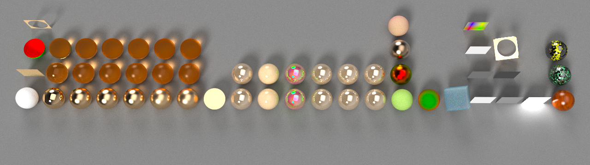
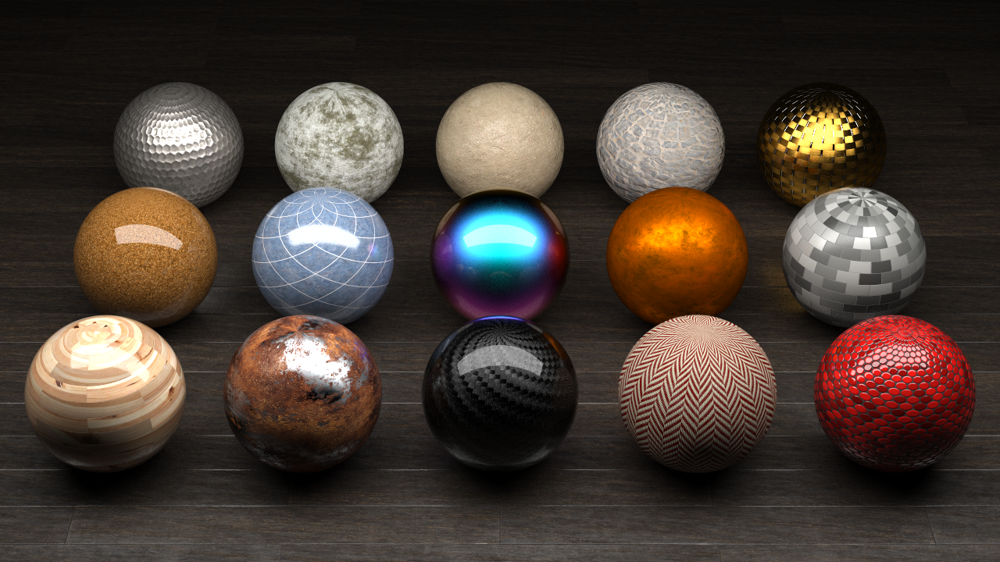

The MDL_renderer has now been updated to also support cubic B-spline curve primitives and the MDL Hair BSDF. 

Because that requires two texture coordinates to be fully featured, the `NUM_TEXTURE_SPACES` define has been added to the `config.h` to allow switching between one and two texture coordinates. If you do not need the hair BSDF, you can set `NUM_TEXTURE_SPACES` to 1 for a little more performance.

The MDL hair BSDF supports a fully parameterized fiber surface accessible via the `state::texture_coordinate(0)` providing (uFiber, vFiber, thickness) values, which allows implementing parameter changes along the whole fiber and even aound it. The provided `mdl/bsdf_hair_uv.mdl` material shows this by placing tiny arrows on the fibers pointing from root to tip.

Additionally the second texture coordinate `state::texture_coordinate(1)` defines a fixed texture coordinate per fiber, which allows coloring of individual fibers depending on some texture value. The image below used a Perlin noise function to produce highlights in the hair, resp. a 2D texture to color the fibers of the `fur.hair` model (included).

The renderer currently loads only `*.hair` models which do not have texture coordinates. The example auto-generates a 2D coordinate with a cubemap projection from the root points' center coordinate. There are better ways to do this when actually growing hair from surfaces, not done in this example. Transparency and color values of *.hair files are ignored. The assigned MDL hair material defines these properties.

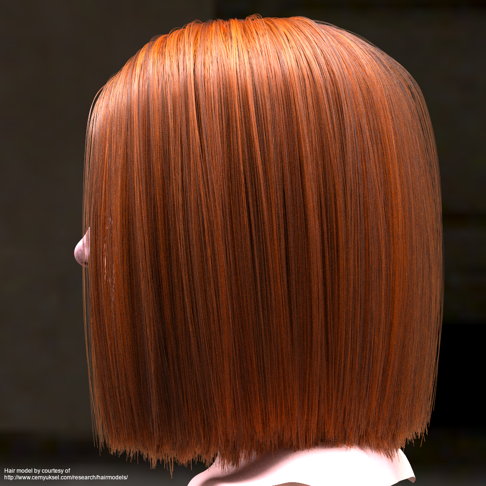
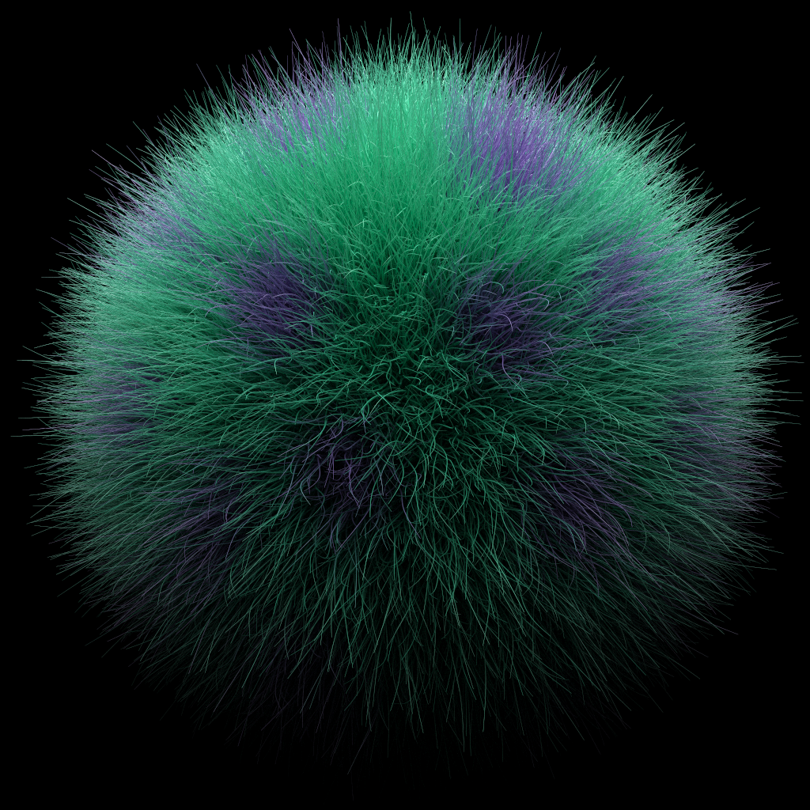

**User Interaction inside the examples**:
* Left Mouse Button + Drag = Orbit (around center of interest)
* Middle Mouse Button + Drag = Pan (The mouse ratio field in the GUI defines how many pixels is one unit.)
* Right Mouse Button + Drag = Dolly (nearest distance limited to center of interest)
* Mouse Wheel = Zoom (1 - 179 degrees field of view possible)
* SPACE  = Toggle GUI display on/off

Additionally in rtigo3, nvlink_shared, rtigo9 and rtigo10:
* S = Saves the current system description settings into a new file (e.g. to save camera positions)
* P = Saves the current tone mapped output buffer to a new PNG file. (Destination folder must exist! Check the `prefixScreenshot` option inside the *system* text files.)
* H = Saves the current linear output buffer to a new HDR file.

# Building

In the following paragraphs, the `*` in all `OptiX7*` expressions stands for the minor OptiX version digit (0 to 7).

The application framework for all these examples uses GLFW for the window management, GLEW 2.1.0 for the OpenGL functions, DevIL 1.8.0 (optionally 1.7.8) for all image loading and saving, local ImGUI code for the simple GUI, and all non-*intro* examples use ASSIMP to load triangle mesh geometry. *rtigo9_omm* uses the OptiX Toolkit CUDA-based Opacity Micromap (OMM) Baking tool to generate OMMs from cutout opacity textures.

GLEW 2.1.0 is required for all examples not named with prefix *intro* for the UUID matching of devices between OpenGL and CUDA which requires a specific OpenGL extension not supported by GLEW 2.0.0. The intro examples compile with GLEW 2.0.0 though.

The top-level `CMakeLists.txt` file will try to find all currently released OptiX 7 SDK versions via the `FindOptiX7*.cmake` scripts inside the `3rdparty/CMake` folder.
These search OptiX SDK 7.0.0 to 7.7.0 locations by looking at the resp. `OPTIX7*_PATH` environment variables a developer can set to override the default 
SDK locations.
If those `OPTIX7*_PATH` environment variables are not set, the scripts try the default SDK installation folders. Since OptiX 7 is a header-only API, only the include directory is required. 

The `FindOptiX7*.cmake` scripts set the resp. `OptiX7*_FOUND` CMake variables which are later used to select which examples are built at all and with which OptiX SDK. (*intro_motion_blur* requires OptiX SDK 7.2.0 or higher, *rtigo9_omm* requires 7.6.0 or higher.)

The individual applications' `CMakeLists.txt` files are setup to use the newest OptiX SDK found and automatically handle API differences via the `OPTIX_VERSION` define.

When using OptiX SDK 7.5.0 or newer and CUDA Toolkit 11.7 or newer, the OptiX device code will automatically be compiled to the new binary OptiX Intermediate Representation (OptiX IR) instead of PTX code.
This can be changed inside the CMakeLists.txt files of the individual examples by commenting out the three lines enabling `USE_OPTIX_IR` and setting nvcc target option `--optixir` and the `*.optixir` filename extension.

**Windows**

Pre-requisites:
* NVIDIA GPU supported by OptiX 7 (Maxwell GPU or newer, RTX boards highly recommended.)
* Display drivers supporting OptiX 7.x. (Please refer to the individual OptiX Release Notes for the supported driver versions.)
* Visual Studio 2017, 2019 or 2022
* CUDA Toolkit 10.x, 11.x or 12.x (Please refer to the OptiX Release Notes for the supported combinations. CUDA 11.8 or higher recommended.)
* Any OptiX SDK 7.x.0. (OptiX SDK 7.7.0 recommended. intro_motion_blur requires 7.2.0 or higher, rtigo9_omm requires 7.6.0 or higher.)
* [OptiX Toolkit](https://github.com/NVIDIA/optix-toolkit) for the CUDA Opacity Micromap baking tool used in rtigo9_omm (requires OptiX SDK 7.6.0).
* [Open-source MDL SDK](https://github.com/NVIDIA/MDL-SDK) or [binary MDL SDK](https://developer.nvidia.com/rendering-technologies/mdl-sdk) supporting MDL 1.7 only required for the MDL_renderer example.
* CMake 3.17 or newer. (Tested with CMake 3.24.2. The OptiX Toolkit requires 3.23.)

3rdparty library setup:
* From the Windows *Start Menu* (Windows' search bar might not find it!), open the *x64 Native Tools Command Prompt for VS2017* or *x64 Native Tools Command Prompt for VS2019* or *x64 Native Tools Command Prompt for VS2022*
* Change directory to the folder containing the `3rdparty.cmd`
* Execute the command `3rdparty.cmd`. This will automatically download GLFW 3.3, GLEW 2.1.0, and ASSIMP archives from sourceforge.com or github.com (see `3rdparty.cmake`) and unpack, compile and install them into the existing `3rdparty` folder in a few minutes.
* Close the *x64 Native Tools Command Prompt* after it finished.

DevIL:
* The *Developer's Image Library* [DevIL](http://openil.sourceforge.net/) needs to be downloaded manually.
  * Go to the *Download* section there and click on the *DevIL 1.8.0 SDK for Windows* link to download the headers and pre-built libraries.
  * If the file doesn't download automatically, click on the *Problems Downloading?* button and click the *direct link* at the top of the dialog box.
  * Unzip the archive into the new folder `optix_apps/3rdparty/devil_1_8_0` so that this directly contains `include` and `lib` folders from the archive.
* Optionally the examples can be built with the DevIL 1.7.8 version which also contains support for EXR images.
  * Follow this link to find various pre-built [DevIL Windows SDK](https://sourceforge.net/projects/openil/files/DevIL%20Windows%20SDK/) versions.
  * Download the `DevIL-SDK-x64-1.7.8.zip` from its respective `1.7.8` folder.
  * If the file doesn't download automatically, click on the *Problems Downloading?* button and click the *direct link* at the top of the dialog box.
  * Unzip the archive into the new folder `optix_apps/3rdparty/devil_1_7_8` so that this directly contains the `include`, `unicode` and individual `*.lib` and `*.dll` files from the archive.
  * Note that the folder hierarchy in that older version is different than in the current 1.8.0 release that's why there is a `FindDevIL_1_8_0.cmake` and a `FindDevIL_1_7_8.cmake` inside the `3rdparty/CMake` folder.
  * To switch all example projects to the DevIL 1.7.8 version, replace `find_package(DevIL_1_8_0 REQUIRED)` in all CMakeLists.txt files against `find_package(DevIL_1_7_8 REQUIRED)`

OptiX Toolkit:
* Go to (https://github.com/NVIDIA/optix-toolkit)
* Clone the repository and update its sub-modules to get the OmmBaking repository included.
* Set the CMAKE_INSTALL_PREFIX to a local path where the OptiX Toolkit `bin`, `include` and `lib` folders should be installed. (The default `C:\Program Files\OptiXToolkit` usually won't work because that is a protected folder under Windows.) The `FindOptiXToolkit.cmake` will find it automatically if the CMAKE_INSTALL_PREFIX is set to the `3rdparty/optix-toolkit` path.
* Configure and Generate the solution for your Visual Studio version and x64 platform
* Open the generated `OptiXToolkit.sln` and rebuild the `Release x64` target.
* Then build the `INSTALL` target.
* Check that the bin, include and lib folders are present inside the folder you selected via CMAKE_INSTALL_PREFIX.

MDL SDK:
* Go to (https://github.com/NVIDIA/MDL-SDK)
* Clone the repository and follow the build instructions in there to build the solution with CMake. (None of the examples are required to be able to build the MDL_render project.)
* Build the release x64 target. 
* Build the INSTALL target.
* Set the environment variable MDL_SDK_PATH to the folder into which you cloned the MDL SDK repository. (The MDL_renderer project only needs the MDL SDK `include` folder location. All libraries are loaded dynamically. `3rdparty/FindMDL_SDK.cmake` will find it and the MDL_renderer project will be added to the solution.)
* For the MDL_renderer example execution only the `libmdl_sdk.dll`, `nv_freeimage.dll` and `dds.dll` libraries from the MDL SDK `install/bin` folder are required. Copy these next to the MDL_renderer executable. The `nv_freeimage.dll` also requires `FreeImage.dll` which needs to come from the FreeImage installation you picked when building the MDL SDK libraries.

Generate the solution:
* If you didn't install the OptiX SDK 7.x into its default directory, set the resp. environment variable `OPTIX7*_PATH` to your local installation folder (or adjust the `FindOptiX7*.cmake` scripts).
* If you didn't install the OptiX Toolkit into `3rdparty/optix-toolkit`, create and set the environment variable `OPTIX_TOOLKIT_PATH=<path_to_optix_toolkit_installation>` (or adjust `FindOptiXToolkit.cmake` script).
* From the Start menu Open CMake (cmake-gui).
* Select the `optix_apps` folder in the *Where is the source code* field.
* Select a new build folder inside the *Where to build the binaries*.
* Click *Configure*. (On the very first run that will prompt to create the build folder. Click OK.)
* Select the Visual Studio version which matches the one you used to build the 3rdparty libraries. You must select the "x64" version! (Note that newer CMake GUI versions have that in a separate listbox named "Optional platform for generator".)
* Click *Finish*. (That will list all examples' `PROJECT_NAME` and the resp. include directories and libraries used inside the CMake GUI output window the first time a `find_package()` is called. Control that this found all the libraries in the 3rdparty folder and the desired OptiX 7.x include directory. If multiple OptiX SDK 7.x are installed, the highest minor version is used.)
* Click *Generate*.

Building the examples:
* Open Visual Studio 2017, 2019 resp. 2022 (matching the version with which you built the 3rd party libraries and generated the solution) and load the solution from your build folder.
* Select the *Debug* or *Release* *x64* target and pick *Menu* -> *Build* -> *Rebuild Solution*. That builds all projects in the solution in parallel.

Adding the libraries and data (Yes, this could be done automatically but this is required only once.):
* Copy the x64 library DLLs: `cudart64_<toolkit_version>.dll` from the CUDA installation bin folder, and from the respective 3rdparty folders: `glew32.dll`, `DevIL.dll`, `ILU.dll`, `ILUT.dll`, `assimp-vc<compiler_version>-mt.dll` and `CuOmmBaking.dll` from the OptiX Toolkit into the build target folder with the executables (*bin/Release* or *bin/Debug*). (E.g. `cudart64_101.dll` from CUDA Toolkit 10.1 or cudart64_110.dll from the matching(!) CUDA Toolkit 11.x or 12.x version and `assimp-vc143-mt.dll` from the `3rdparty/assimp` folder when building with MSVS 2022.)
* IMPORTANT: Copy all files from the `data` folder into the build folder with the executables (`bin/Release` or `bin/Debug`). The executables search for the texture images relative to their module directory.

**Linux**

Pre-requisites:
* NVIDIA GPU supported by OptiX 7 (Maxwell GPU or newer, RTX boards highly recommended.)
* Display drivers supporting OptiX 7.x. (Please refer to the individual OptiX Release Notes for the supported driver versions.)
* GCC supported by CUDA 10.x or CUDA 11.x Toolkit
* CUDA Toolkit 10.x, 11.x or 12.x. (Please refer to the OptiX Release Notes for the supported combinations. CUDA 11.8 or higher recommended.)
* Any OptiX SDK 7.x version (OptiX SDK 7.7.0 recommended. intro_motion_blur requires 7.2.0 or higher, rtigo9_omm requires 7.6.0 or higher.)
* CMake 3.17 or newer.
* GLFW 3
* GLEW 2.1.0 (required to build all non-*intro* examples. In case the Linux package manager only supports GLEW 2.0.0, here is a link to the [GLEW 2.1.0](https://sourceforge.net/projects/glew/files/glew/2.1.0) sources.)
* DevIL 1.8.0 or 1.7.8. When using 1.7.8 replace `find_package(DevIL_1_8_0 REQUIRED)` against `find_package(DevIL_1_7_8 REQUIRED)`
* ASSIMP
* OptiX Toolkit (https://github.com/NVIDIA/optix-toolkit) for the CUDA Opacity Micromap baking tool used in rtigo9_omm (requires OptiX SDK 7.6.0). Clone the repository and update its submodules to get the OmmBaking repository included. Set the CMAKE_INSTALL_PREFIX to a path where the bin, include and lib folders of the OptiX Toolkit should be installed. That's the folder specified via the OPTIX_TOOLKIT_PATH environment variable on the CMake command line below when building these examples. Configure and Generate the solution and rebuild the release target. Then build the INSTALL target. Check that the bin, include and lib folders are present inside the folder you selected via CMAKE_INSTALL_PREFIX.
* [Open-source MDL SDK](https://github.com/NVIDIA/MDL-SDK) or [binary MDL SDK](https://developer.nvidia.com/rendering-technologies/mdl-sdk) supporting MDL 1.7 only required for the MDL_renderer example.

Build the Examples:
* Open a shell and change directory into the local `optix_apps` source code repository:
* Issue the commands:
* `mkdir build`
* `cd build`
* `OPTIX77_PATH=<path_to_optix_7.7.0> OPTIX_TOOLKIT_PATH=<path_to_optix_toolkit> MDL_SDK_PATH=<path_to_MDL_SDK> cmake ..` 
  * Similar for all other OptiX 7.x.0 SDKs by changing the minor version number accordingly. Some examples won't be built when using older OptiX SDK versions.
* `make`
* IMPORTANT: Copy all files from the `data` folder into the `bin` folder with the executables. The executables search for the texture images relative to their module directory.

Instead of setting the temporary OPTIX77_PATH environment variable, you can also adjust the line `set(OPTIX77_PATH "~/NVIDIA-OptiX-SDK-7.7.0-linux64")` inside the `3rdparty/CMake/FindOptiX77.cmake` script to your local OptiX SDK 7.7.0 installation. Similar for the other OptiX 7.x.0 versions.

# Running

IMPORTANT: When running the examples from inside the debugger, make sure the working directory points to the folder with the executable because files are searched relative to that. In Visual Studio that is the same as `$(TargetDir)`. The default is `$(ProjectDir)` which will not work!

Open a command prompt and change directory to the folder with the executables (same under Linux, just without the .exe suffix.)

Issue the commands (same for *intro_driver*, *intro_denoiser* and *intro_motion_blur*):
* `intro_runtime.exe`
* `intro_runtime.exe --miss 0 --light`
* `intro_runtime.exe --miss 2 --env NV_Default_HDR_3000x1500.hdr`

Issue the commands (similar for the other scene description files):

* `rtigo3.exe -s system_rtigo3_cornell_box.txt -d scene_rtigo3_cornell_box.txt`
* `rtigo3.exe -s system_rtigo3_single_gpu.txt -d scene_rtigo3_geometry.txt`
* `rtigo3.exe -s system_rtigo3_single_gpu_interop.txt -d scene_rtigo3_instances.txt`

The following scene description uses the [Buggy.gltf](https://github.com/KhronosGroup/glTF-Sample-Models/tree/master/2.0/Buggy/glTF) model from Khronos which is not contained inside this source code repository.
The link is also listed inside the `scene_rtigo3_models.txt` file.

* `rtigo3.exe -s system_rtigo3_single_gpu_interop.txt -d scene_rtigo3_models.txt`

If you run a multi-GPU system, read the `system_rtigo3_dual_gpu_local.txt` for the modes of operation and interop settings.

* `rtigo3.exe -s system_rtigo3_dual_gpu_local.txt -d scene_rtigo3_geometry.txt`

The nvlink_shared example is meant for multi-GPU systems with NVLINK bridge. It's working on single-GPU setups as well though. I've prepared a geometry-heavy scene with 125 spheres of more than 1 million triangles each. That scene requires about 10 GB of VRAM on a single board.

* `nvlink_shared.exe -s system_nvlink_shared.txt -d scene_nvlink_spheres_5_5_5.txt`

The rtigo9 and rtigo10 examples use an enhanced scene description where camera and tone mapper values can be overridden and materials for surfaces and lights and all light types themselves can be defined per scene now. For that the material definition has changed slightly to support surface and emission distribution functions and some more parameters. Read the provided `scene_rtigo9_demo.txt` file for how to define all supported light types.

* `rtigo9.exe -s system_rtigo9_demo.txt -d scene_rtigo9_demo.txt`

That `scene_rtigo9_demo.txt` is not using cutout opacity or surface materials on arbitrary mesh lights, which means using it with rtigo10 will result in the same image, it will just run considerably faster.

* `rtigo10.exe -s system_rtigo9_demo.txt -d scene_rtigo9_demo.txt`

The rtigo9_omm example uses Opacity Micromaps (OMM) which are built using the OptiX Toolkit CUDA OMM Baking tool.
The following command loads a generated OBJ file with 15,000 unit quads randomly placed and oriented inside a sphere with radius 20 units. (Generator code is in `createQuads()`). The material assigned to the quads is texture mapped with a leaf texture for albedo and cutout opacity. The same command line can be used with rtigo9 to see the performance difference esp. on Ada generation GPUs which accelerate OMMs in hardware. (Try higher rendering resolutions than the default 1024x1024.)

* `rtigo9_omm.exe -s system_rtigo9_leaf.txt -d scene_rtigo9_leaf.txt`

The MDL_renderer example uses the NVIDIA Material definition language for the shader generation.
The following scene only uses the *.mdl files and resources from the `data/mdl` folder you copied next to the executable after building the examples.
These show most of the fundamental MDL BSDFs, EDFs, VDFs, layers, mixers, modifiers, thin-walled geometry, textures, cutout opacity, base helper functions, etc.

* `MDL_renderer.exe -s system_mdl_demo.txt -d scene_mdl_demo.txt`

For a lot more complex materials (this scene requires about 5.4 GB of VRAM), the following command line will work if you have the [NVIDIA MDL vMaterials 1.7, 2.0, and 2.1](https://developer.nvidia.com/vmaterials) installed on the system. The application should then automatically find the referenced materials via the two environment variables `MDL_SYSTEM_PATH` and `MDL_USER_PATH` set by the vMaterial installation script. If a material was existing as reference but couldn't be compiled because it wasn't found or had errors, the renderer will not put the geometry with that invalid shader into the render graph. Means without the vMaterials installed only the area light should work in that scene because that is using one of the *.mdl files from the data folder. The result should look similar to the MDL_renderer example screenshot above, where some parameter values had been tweaked.

* `MDL_renderer.exe -s system_mdl_vMaterials.txt -d scene_mdl_vMaterials.txt`

For the curves rendering with MDL hair BSDF materials, issue the command line. That will display a sphere with cubic B-spline curves using a red hair material lit by an area light from above. Please read the `scene_mdl_hair.txt`  for other possible material and model configurations.

* `MDL_renderer.exe -s system_mdl_hair.txt -d scene_mdl_hair.txt`

# Pull Requests

NVIDIA is happy to review and consider pull requests for merging into the main tree of the optix_apps for bug fixes and features. Before providing a pull request to NVIDIA, please note the following:

* A pull request provided to this repo by a developer constitutes permission from the developer for NVIDIA to merge the provided changes or any NVIDIA modified version of these changes to the repo. NVIDIA may remove or change the code at any time and in any way deemed appropriate.
* Not all pull requests can be or will be accepted. NVIDIA will close pull requests that it does not intend to merge.
* The modified files and any new files must include the unmodified NVIDIA copyright header seen at the top of all shipping files.

# Support

Technical support is available on [NVIDIA's Developer Forum](https://forums.developer.nvidia.com/c/gaming-and-visualization-technologies/visualization/optix/167), or you can create a git issue.
