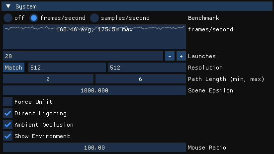
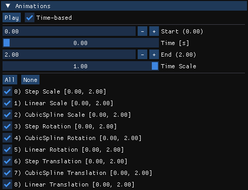
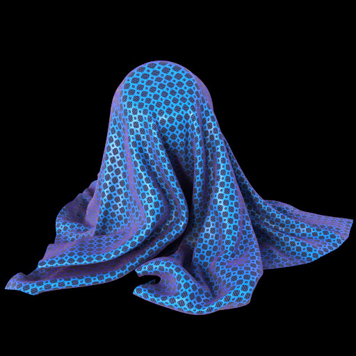
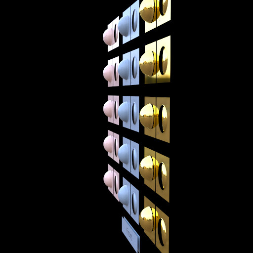
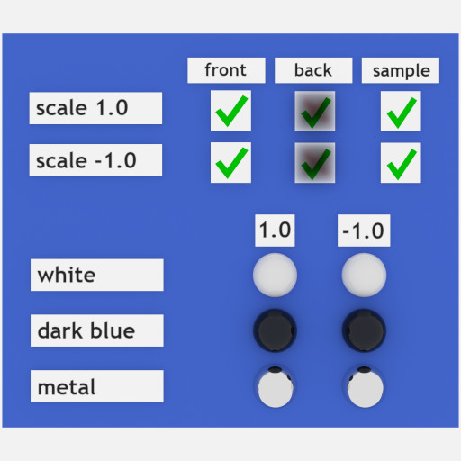

# GLTF_renderer

The **GLTF_renderer** example shows how to implement a viewer application for the [Khronos glTF 2.0](https://github.com/KhronosGroup/glTF/tree/main/specification/2.0) file format.

The main renderer window supports drag-and-drop of `*.gltf` and `*.glb` files, which will replace the currently loaded glTF asset (see command line option `--file (-f) <filename>`), and drag-and-drop of `*.hdr` files to replace the current spherical HDR environment light (see command line option `--miss (-m) 2`).

It's using the [NVIDIA OptiX Ray Tracing SDK](https://developer.nvidia.com/rtx/ray-tracing/optix) to build a renderer supporting the glTF 2.0 Physically Based Rendering (PBR) material and additional [glTF 2.0 extensions](https://github.com/KhronosGroup/glTF/tree/main/extensions) in a global illumination unidirectional path tracer.

The GLTF_renderer OptiX device code is based on the existing example code in **rtigo12** for most of the BXDFs which are derived from the [NVIDIA MDL SDK](https://github.com/NVIDIA/MDL-SDK) libbsdf code.

Not every glTF feature is implemented in this version. Please note the current implementation limitations below.

It has been tested with the Khronos [glTF-Sample-Assets](https://github.com/KhronosGroup/glTF-Sample-Assets) which have been used to render all glTF images in this documentation.

glTF points have been tested with point-cloud datasets like [Aoshima Pier](https://sketchfab.com/3d-models/aoshima-pier-point-cloud-9b8a296659274a39a054ca3408145a1b#download), [VHF Skull](https://sketchfab.com/3d-models/vhf-skull-point-cloud-47107f5d88f24cc9b051642501a64a9e) and with [Khronos PrimitiveModeNormalTest](https://github.com/KhronosGroup/glTF-Sample-Models/tree/main/2.0/PrimitiveModeNormalsTest).

**IMPORTANT:** 

The GLTF_renderer is now a **standalone solution** which needs to be built separately from the other OptiX_Apps examples because it demonstrates the **CMake LANGUAGES CUDA** feature to build native CUDA kernel binaries and calls these with the CUDA runtime chevron `<<<>>>` operator! That is currently used to implement the expensive skinning animation on the GPU (inside the `kernel_skinning.cu` file).

On Linux: before running cmake, make sure that the `$CUDACXX` environment variable is set, otherwise a wrong CUDA version could be selected. A possible value is `/usr/local/cuda-13.0/bin/nvcc` (you can use older versions, depending on the GPU architectures to support).

To separate the **OptiX device code translation** from `*.cu` to OptiX-IR binary or PTX source modules from the applications native CUDA kernels, CMake requires a separate **Object Library**.

Also note that the GLTF_renderer OptiX device code modules are only copied into the `GLTF_renderer_core` folder next to the current build target executable when the **INSTALL** target is built! That can be done automatically when enabling it inside the MSVS **Build -> Configuration Manager** dialog. It will then always copy only the changed modules on each build. (I have not found a better automatic method under the multi-target build system, where target file names are only provided as generator expressions). Unfortunately that INSTALL build option needs to be re-enabled every time the `CMakeLists.txt` is changed.

The native CUDA kernel code generation is also currently configured to only generate binaries for Pascal to Ada GPU architectures (see `set(CMAKE_CUDA_ARCHITECTURES 60 70 75 80 86 89)`). 
Newer architectures will be supported automatically by JIT compiled PTX code of the newest available SM version inside the executable.

Also the OptiX device code is translated to at least Pascal GPUs. (See `set_property(TARGET ${OPTIX_LIB} PROPERTY CUDA_ARCHITECTURES 60)`).

If support for older Maxwell GPU (SM 5.0 and 5.2) would need to be added resp. set in these above settings. when required.

Please read the `GLTF_renderer/CMakeLists.txt` file for more details.

## glTF 2.0 extensions

The application handles the following [glTF 2.0 extensions](https://github.com/KhronosGroup/glTF/tree/main/extensions) on top of the base glTF 2.0 specifications.

* KHR_lights_punctual
* KHR_materials_anisotropy
* KHR_materials_clearcoat
* KHR_materials_emissive_strength
* KHR_materials_ior
* KHR_materials_iridescence
* KHR_materials_sheen
* KHR_materials_specular
* KHR_materials_transmission
* KHR_materials_unlit
* KHR_materials_variants
* KHR_materials_volume
* KHR_mesh_quantization
* KHR_texture_transform
* EXT_meshopt_compression

## Material Model

The renderer implements the glTF 2.0 Physically Based Rendering (PBR) model from the specifications enhanced by the above-mentioned extensions which results in the following schematic weighting of individual BXDFs.

Note that the weights of these individual distribution functions sum up to 1.0 by construction. Currently the renderer picks one of the active distribution functions stochastically according to its weight and samples and evaluates only. That makes the renderer fast but also requires quite some samples per pixel to gather all contributions. Not shown inside the diagram is that the presence of iridescence adds another stochastic condition which takes care of the iridescence strength.

Emissive materials on triangle meshes are currently only handled for implicit hits.
That is because many glTF models are simply applying an emissive texture over the whole geometry with a lot of texture area being black (e.g. DamagedHelmet.gltf). Implementing explicitly sampled mesh lights from that would be really inefficient when not limiting the light sampling to triangles which are actually containing emissive texels, which means a pre-process integrating the emissive texture over the triangle area to limit the explicit sampling to only those. That is currently not implemented. Morphing emissive geometry would require recalculating the CDF over the triangle area for the uniform sampling, so that entire process should be done on the GPU in the end.

Ambient occlusion textures are supported, although ambient occlusion usually happens automatically in a global illumination renderer with environment lights. For performance reasons many glTF models are rather low-resolution and bake geometric details into normal and occlusion maps. The renderer applies the provided ambient occlusion value to the diffuse and metal reflection lobes and only for environment lights. The GUI allows switching ambient occlusion textures off for all materials with the *Ambient Occlusion* checkbox inside the *System* panel.

The renderer implements dielectric transmissions which also work with alpha modes. Note that the alpha mode MASK and BLEND are not compatible with materials using KHR_materials_volume. The alpha blending transparency requires that such materials are handled as thin-walled, so there is neither refraction nor volume absorption possible on them. Other than that, the combinations of alpha modes with transmissions simply work.

## Current Implementation Limitations

The following glTF 2.0 core features are not implemented, yet:

* Any other geometric primitive than Triangles, Points.
* Filenames with Unicode characters.

## glTF Points

glTF points are implemented as OptiX spheres.
The sphere radius (given with the cmd line *-r* option, see below) might need tweaking, depending on scene size and density of points (CT datasets need a radius larger than the renderer's default).
Beauty tip: switch off the 'unlit' flag in the UI if the spheres look like flat disks.

## Open-Source Software Libraries 

The GLTF_renderer example uses the following open-source software libraries:

* [GLFW](https://github.com/glfw/glfw) for the windowing framework.
* [GLEW](https://glew.sourceforge.net/) for the OpenGL function pointer loading.
* [FASTGLTF](https://github.com/spnda/fastgltf) for the glTF 2.0 parsing and data loading.
* [GLM](https://github.com/g-truc/glm) for the matrix, vector, and quaternion functionality.
* [STB](https://github.com/nothings/stb) for the 8-bit glTF asset images handling.
* [IMGUI](https://github.com/ocornut/imgui) for the graphical user interface.
* [DevIL](https://openil.sourceforge.net) for the spherical HDR environment texture loading and screenshot functionality-

**IMPORTANT**: Please see the root README.md for the build instructions!

# Application

## Command Line

The executable supports the following command line options. The value in brackets () is the default.

* `?` or `--help` or `help`

    Print the usage message and exit. Also done when the command line parsing fails.

* `--file (-f) <filename>` (empty)

    Filename of a `*.gltf` or `*.glb` glTF asset.
    
    If no filename is given the application starts with an empty scene. The renderer window accepts drag-and-drop events of `*.gltf` or `*.glb` files and will try loading the first entry of the dropped filenames which will replace the current asset if loading succeeded.

* `--width (-w) <int>` (512)

    Default width of the client window in pixels.

* `--height (-h) <int>` (512)

    Default height of the client window in pixels.

* `--xres (-x) <int>` (512)

    Default x-resolution (width) of the rendered image, independent of the client window size. Can be changed inside the GUI.
    
    The rendered image will be centerered inside the client window region. When the image is scaled down to fit, the background around the image is cleared in dark red, otherwise in black.

* `--yres (-y) <int>` (512)

    Default y-resolution (height) of the rendered image, independent of the client window size. Can be change inside the GUI.

* `--launches (-l) <int>` (1)

    Number of asynchronous optixLaunch calls per render() call in range [1, 1000]. Can be changed inside the GUI.

* `--interop (-i) <int>` (0)

    CUDA-OpenGL interoperability mode: 0 = off, 1 = pbo, 2 = array copy, 3 = surface write.

    * PBO: OpenGL allocates a Pixel-Buffer Object with float4 format and resizes it to the rendering resolution (client window size). The OptiX renderer is directly accumulating results into the mapped linear PBO memory. The OpenGL texture used to display the rendered image to the back buffer of the window is updated with a device-to-device copy from linear PBO to block-linear OpenGL texture.

    * Copy to CUDA texture array: The OptiX rendering happens inside a native float4 CUDA buffer. The OpenGL display texture level 0 image is mapped as a CUDA texture array and the native linear CUDA buffer with the rendered image is copied device-to-device into the block-linear OpenGL texture image.

    * CUDA surface writes: CUDA creates a surface object for the OpenGL HDR display texture image of level 0 and reads and writes directly into that with surf2Dread/surf2Dwrite instructions inside the specialized ray generation for that mode. No additional buffer copy needs to happen.

    Note the CUDA-OpenGL interop mode can only be enabled if the CUDA device matches the device running the NVIDIA OpenGL implementation, which is usually the primary device inside a multi-GPU system. The application is checking via the LUID (under Windows) or the UUID (under Linux or Windows) if the selected CUDA device is the same as the OpenGL reported LUID or UUID and only then allows interop.

* `--punctual (-p) <int>` (1)

    Select KHR_lights_punctual support: 0 = off, all other values = on.

    The KHR_lights_punctual extension adds support for singular point, spot, and directional light types. Some glTF assets make use of that for lighting. Since singular light types are producing hard shadows and rendering artifacts especially on low-polygon models, this option allows ignoring the singular lights completely if desired. Use one of the environment lights there renderer implements then.
    
    Note that singular lights won't work without direct lighting, which can be toggled inside the GUI's *System* panel.

* `--miss (-m) <0|1|2>` (2)

    Select the miss shader which defines the environment light: 0 = null (black, not a light), 1 = constant color, 2 = spherical HDR environment texture.

    The black environment only makes sense for scenes with KHR_lights_punctual, models with emissions, or in unlit mode, otherwise the resulting image will just be black.
    
    The constant color environment light is uniformly sampled and defaults to white (1.0) which can be changed inside the GUI.

    The spherical HDR environment light also defaults to a white (1.0) environment texture if the command line option --env (-e) below is not used. With this spherical HDR environment light active, the main window reacts to drag-and-drop events of `*.hdr` filenames which will replace the environment texture with the dropped one when loading succeeded. This can take a while for big textures because the cumulative distribution function (CDF) for the importance sampling of the texture is calculated on the CPU at this time.

    TIP: Try disabling direct lighting inside the GUI while using a HDR environment texture with a very small bright area (sun on clear sky) to see the effectiveness of that light type's importance sampling.

* `--env (-e) <filename>` (empty)

    Filename of a spherical HDR texture map image.

    When the default command line option --miss (-m) 2 is used, this --env (-e) option can define a spherical HDR environment texture filename which is loaded instead of the default generated white environment texture. Drag-and-drop of another `*.hdr` environment texture will replace that again.

* `--radius (-r) <fraction>` (0.005)

    Radius of the spheres for the glTF points. The fraction is relative to the scene diameter.

## Viewport Interactions

* Key
  * `SPACE` Toggle GUI window display
  * `P` Save current image as tone mapped `*.png` into the current working directory as *img_gltf_<yyyymmdd_hhmmss_ms>.png*
  * `H` Save image as linear `*.hdr` into the current working directory as *img_gltf_<yyyymmdd_hhmmss_ms>.hdr*
  * `A` Move camera to the left
  * `S` Move camera back
  * `D` Move camera to the right
  * `W` Move camera forward
  * `E` Move camera up
  * `Q` Move camera down

* Mouse Button (`MB`)
  * `LMB` Orbit camera
  * `MMB` Pan camera
  * `RMB` Dolly camera
  * `Mouse Wheel` Zoom (change field of view angle)
  * `Ctrl+LMB` Pick material index from object under mouse cursor. Switches the Material GUI to that material index.

## GUI

General notes about the GUI usage:

For all GUI elements which display a list of scene elements inside a list box, the application prefixes each list element with an index, like `0) <name>`.
That's is done because ImGui requires unique labels for GUI elements but names are optional inside glTF and often empty.

In ImGui, all editable fields, including sliders, can be directly edited by entering values when clicking into the field with Ctrl+LMB.

The ImGui color picker widget might not result in perfect 0.0 or 1.0 values in the corners of the color gradient widget. Use the RGB or HSV controls instead if that is required.

The application is using the ImGui *Docking* branch code, which allows dragging the GUI window outside of the application window to avoid overlap with the rendered image. This functionality is only enabled under Windows so far because the ImGui documentation mentioned that this is unstable under Linux/X11 and not supported under Wayland. (I'm not using Linux at all, so this is not tested).

### System

* **Benchmark** (radio buttons: off (default), frames/second, samples/second)

    The benchmark radio buttons allow two select two different benchmark modes inside the application.
    
    The **frames/second** option measures the complete pipeline with animation, raytracing, rasterization (image and GUI) and final display of the image texture and swapbuffers. (If this results in framerates limited to the monitor refresh rate, like 60 Hz, then force the the `Vsync` option inside the NVIDIA Display Control Panel to `off`!)
    
    The **samples/second** option changes the code path inside the render() function to measure the pure raytracing performance in number of samples, which matches the asynchronous optixLaunch invocations. This does does **not** include the time it takes to migrate the rendered image to the OpenGL texture or the display to the screen. The number of samples/second is greatly affected by the next GUI field *Launches*.
    
    For both benchmark modes, the result is displayed as line plot inside the GUI with an average and maximum value as overlay.

* **Launches** (integer, range [1, 1000], default 1)

    The number of asynchronous optixLaunches sent to the CUDA stream per render() call. The value needs to be submitted with the RETURN key when editing manually. The higher the number, the more samples per pixel will be rendered per render() call which reduces noise and results in faster ray tracing because less time is spent on displaying the scene. That will also reduce the interactivity. The default is set to the slowest value 1 to start running at maximum interactivity on any supported GPU. Note that high-end GPUs can easily reach over 10,000 samples per pixel with most of the [Khronos glTF-Sample-Models](https://github.com/KhronosGroup/glTF-Sample-Models) at the default window size. Use the command line option --launches (-l) to change the initial value at application start.
    
* **Path Length (min, max)** (slider, range [0, 100], default min 2, max 6)

    The maximum path length defines how many ray segments are followed along each path inside the ray generation program before terminating it. The higher the maximum number, the more ray segments can be followed, the more reflections or transparency layers can become visible, the slower the renderer can get. The default of 6 is a value chosen to produce correct results when having simple transparent objects inside the scene. A value of 0 produces a black image because that wouldn't even shoot the primary rays. Use at least 2 to have a decent result from the direct lighting.

    The minimum path length sets a threshold at what path segment (the integrators *depth* variable) the Russian Roulette path termination should kick in. Means setting the value to 0 will do that after the primary ray returned already. The lower the value, the faster the renderer, but that will also increase the variance, visible as the typical Monte Carlo high-frequency noise. Set this value greater or equal to the maximum path length to disable Russian Roulette path termination.

* **Scene Epsilon** (float, range [0, 10000], default 1000)

    The scene epsilon is a factor on the SCENE_EPSILON_SCALE (1.0e-7f) which move the ray tmin value along the ray direction to avoid self-intersections with the surface a continuation ray starts from. Because this is a scene size depended method, this can be adjusted if there are "shadow acne" effects (usually darker circular artifacts on flat surfaces) due to self-intersection when testing light visibility. (Set this to zero to see what self-intersections look like). There are more robust ways to solve self-intersection artifacts, not shown in this example.

* **Force Unlit** (boolean, default off)

    Override all materials to be rendered as unlit. This is not changing the materials' unlit state individually but just forces the renderer to use the unlit result which is the material base color.
    This is useful to see if there is anything inside the scene for assets which haven't been modeled to work with global illumination and might stay black. (VirtualCity.gltf is one such case, which is an interesting model for camera animations though). 

* **Direct Lighting** (boolean, default on)

    Switch between direct lighting and brute force path tracing. Note that singular lights (point, spot, directional added by the KHR_lights_punctual extension) only work with direct lighting! Direct lighting ("next event estimation") greatly affects the rendering quality. With the importance sampled spherical HDR environment map light, the difference between direct lighting and brute force unidirectional path tracing is stunning. Try that with an environment light which contains a small bright area light (e.g. sun at clear day) 

* **Ambient Occlusion** (boolean, default on)

    Toggle support for ambient occlusion textures inside the renderer. Ambient occlusion is usually not required with global illumination renderers because that effect happens automatically during lighting calculations. (When using a constant white environment, a white diffuse material, a maximum path length of 2, the renderer will produce an ambient occlusion image). Though low-polygon glTF models often bake details from an originally higher resolution model into normal maps and occlusion maps, the renderer is handling occlusion values as well. It applies the occlusion value to the diffuse and metal reflection lobes only when lit by environment lights (constant or spherical HDR environment).

* **Show Environment** (boolean, default on)

    Switch between the environment background or a black background. This allows to render models with nice environment map lighting while not showing the actual environment in the background. This is especially useful for orthographic cameras where the environment background is always a solid color of a single point on the environment texture because all rays have the exact same direction and only that defines which texture coordinate is sampled.

* **Gimbal Lock** (boolean, default on)

    Controls if the trackball should lock the up-axis for the orbit operation which is usually the easier control because the view remains upright, but when the scene or camera setup is not aligned horizontally, disabling the gimbal lock allows rolling the view as well.

* **Mouse Ratio** (float, default 100)

    The camera pan (MMB), dolly (RBM), orbit (LMB) operations change the camera position one scene unit per mouse ratio value (pixels). With very big scenes, the value can be set lower to move the camera more, and vice versa for very small scene extents where higher mouse ratio values allow more precise movements. Zoom is not not affected by this.

### Tonemapper

The tonemapper is implemented as GLSL shader which is applied to the linear HDR image inside the OpenGL display texture as post-process. Changes to the tonemapper values do not require a restart of the rendering accumulation.

* **Balance** (color, default white) modulates the linear HDR color before tonemapping.
* **Gamma** (float, default 2.2, linear is 1.0) converts linear HDR image into gamma corrected color space.
* **White Point** (float, default 1.0) selects which HDR color component value is mapped to 1.0. (Inverse of Brightness control, affects the same shader variable).
* **Burn Lights** (float, default 0.8, linear is 1.0) changes color highlights. Higher values emphasize highlights in the image.
* **Crush Blacks** (float, default 0.2, linear is 0.0) changes color shadows. High values emphasize dark areas in the image.
* **Saturation** (float, default 1.2, linear is 1.0). Higher values increase the color saturation. A value of 0.0 produces a greyscale image from the luminance values of tonemapped image.
* **Brightness** (float, default 1.0) multiplies the linear HDR color before tonemapping. (Inverse of White Point, affects the same shader variable).
   
### Scenes

The **Scenes** pane is only displayed if the glTF asset contains more than one scene. 

Then it shows a list box with all scene names inside the asset which allows selecting which scene should be displayed.
During initial startup of the application and whenever the current scene changes, the application traverses through all nodes reachable inside the current scene and determines which geometries are visible under which transformation and if the acceleration structure (AS) needs to be built. After the necessary geometry AS are available, the top-level instance acceleration structure is always rebuilt, and the launch parameters are updated with that.
Geometry AS for currently non-reachable geometries are not deleted, so switching back and forth between scenes will then only rebuild the IAS which is fast.

If the asset contains no scene definitions, the application is searching all nodes which are not children of any other node and uses those root nodes to create a scene and since there is only one, the scenes pane is not shown.

### Cameras

The **Cameras** pane is only displayed if the glTF asset contains more than one camera.

The list box inside that shows the currently selected camera index and name inside the loaded glTF asset.

The renderer implements both perspective and orthographic cameras defined by glTF.

The current transformation for each camera is tracked individually, means the mouse interactions (orbit, pan, dolly, zoom) are affecting only the currently active camera and are persistent.

Note that the orthographic camera definition inside glTF is always defining a near and far limit (because that is how OpenGL works). The ray tracer is not applying these limits though. The rays are all shot from the plane at the current camera position into the current view direction.

The mouse wheel changes the field of view angle of perspective cameras (zoom), while it scales the magnification values on an orthographic camera, which has a similar effect.

Also note that orthographic camera rays will all show the same point of the environment, so it makes sense to disable the environment display when that is too irritating with a HDR environment light.

If the loaded glTF asset does not contain any camera definition, the application adds a perspective camera which is placed on the positive z-axis and in a distance depending on the maximum extent of the scene to show the whole model. (If the model is not visible, try orbiting the camera. Some models have geometry only in the xz-plane and are looked at edge-on).

### Animations

The **Animations** pane is only shown if there are animations inside the glTF asset.

The application supports **Scale-Rotation-Translation** animations which is defined by times in seconds, scale/rotation/translation values, and interpolation modes inside the asset.
It also supports **Morphing** of vertex attributes position, normal, tangent, color_0, texcoord_0, texcoord_1 and **Skinning** of vertex attributes position, normal, tangent on the GPU using native CUDA kernels. Only the morph weights are animated on the CPU.

The animation values drive the respective node values which in turn affect the matrices or weights inside the glTF asset's node tree.

Initially when loading a glTF asset, all animations are disabled because models with animations wouldn't accumulate a noise free image while animating with default render settings.

Also since different animations can drive the same nodes in glTF, for example, when defining a `walk` and a `run` animation for the same model, the GUI allows enabling each animation individually via a checkbox which contains the index and name (can be empty) of the animation. 

For convenience, there are also two buttons `All` and `None` which activate all or none of the animations.

Once any of the animations is enabled, the rest of the animation widgets are also enabled.

The animation can be played by pressing the `Play` button, which then changes to a `Stop` button, and loops automatically through the user defined [Start, End] interval.

The default animation controls are time-based and the animation runs in **real-time**!
Means depending on the performance of the GPU, the selected OpenGL interop mode used to display the rendered image, and the number of launches per render() call, the animation display can be more or less smooth, but this is how the asset actually defined the animation speed.

There is a user controlled `Start` and `End` time value which can be changed by Ctrl+LMB click, edit, and RETURN, or with the `+` and `-` buttons. The start time must always be greater or equal to zero and smaller than the end time.

The number in brackets behind the `Start` and `End` labels shows the minimum and maximum times over all animations inside the asset. 

When a start or end time is outside the time range of a so called animation sampler controlling the interpolation of the values, the animation is clamped to the value at the respective sampler's minimum or maximum time.

While the animations are stopped, the `Time` slider can be used to scrub through the animation time range.

The `Time Scale` slider allows to slow down the time based animation.

When toggling the `Time-based` checkbox, the animation GUI changes to a keyframe-based display which offers a `Start` and `End` frame value and a current `Frame` slider which can again be used to scrub through the user defined animation frame range [Start, End] while the animations are stopped.

Additionally there is an adjustable `Frames/Second` field which defaults to 30.0 frames/second (minimum 1.0). The higher the value, the smoother the animation.

The value in brackets of the 'End' label is the number of frames required to reach after the animation maximum time at the current Frames/Second value. This is recalculated when changing the `Frames/Second` value and also used as default for `End` field then.

The animation speed of the keyframe mode depends only on how fast each render call can raytrace the current image, which in turn depends on the number of asynchronous launches per 
render call. (See the **Command Line** and **System** chapters above for how to control the number of launches). The higher the value, the lower the noise level during animation.

### Variants

The **Variants** pane is only displayed if the glTF asset contains variants.

Variants allow switching a complete set of materials on a model, which is often used in configurator applications. When switching variants, that remaps the material indices used on the primitives accordingly. The renderer handles that change of material assignments and checks if any of the geometry AS need to be rebuilt because the alphaMode or face-culling state have changed because these states are affecting the OptiX build flags for the GAS.

### Materials

The Materials pane is only shown if the asset defines materials. 

Note that it's possible to *not* assign a material to a primitive and that needs to use a default material which is effectively a white plastic and that cannot be edited inside the material editor because that doesn't appear inside the list of materials of the asset.

Inside the GUI, all per texture checkboxes are only shown when the original material uses that respective texture. Then the checkbox allows disabling and re-enabling that specific texture.

* **Material** (list box, default shows material index 0)
 
    This shows the index and name (when present) of the currently active material inside the GUI. This can also be selected by clicking with **Ctrl+LMB** inside the scene. The material index of the geometry below the mouse cursor will be displayed inside the GUI.

    All following GUI elements inside the GUI will affect the currently selected material index.

* **Reset** (button)

    Reset all parameters to the original values used inside the asset.

* **unlit** (boolean)

    This checkbox toggles the **unlit** state added by the KHR_materials_unlit extension. This is useful to quickly check which geometries inside a scene use the current material.
    The material will simply be displayed with its base color RGB value, which is the product of the color attribute, the baseColorFactor, and the baseColorTexture at the current hit point. The current ray path ends there. This is effectively a self-illuminated material. It's used in some glTF test scenes to display text. It's also useful when an asset scene is only showing black geometry because there are errors inside the scene, material, or light setup.

* **doubleSided** (boolean)

    Toggles the double-sided state of the material. When this is off, the geometry is single-sided and will be face-culled unless the material is also using KHR_material_volume (see below).
    Changing the face-culling state will require a rebuild of the acceleration structure of the meshes using the currently active material because the face-culling feature is part of the GAS build flags.

    Note that face-culled geometry is effectively a physically non plausible material property which is not boding well with global illumination light transport. There are glTF test scenes which test the face-culling under different transformations which will show some correct but unexpected results when face-culled geometry is put in front of visible geometry. The reflection and shadow rays shot from the visible geometry will actually see the face culled geometry from the front side and produce reflections and shadows where the current camera position will not show anything. Enabling face culling would fail that test though, so the feature is adhered to.

* **alphaMode** (list box)

    glTF supports three alpha modes (OPAQUE, MASK, BLEND) which control the opacity behavior of the geometry surface. Each if these three modes behave differently with respect to the necessary opacity evaluation inside the renderer, which happens inside the anyhit programs of the radiance and shadow rays for mask and blend alpha modes only.
    The alpha (opacity) value is the product of the color attribute, baseColorFactor, and baseColorTexture alpha channels. 0.0 is fully transparent, 1.0 is fully opaque, so its meaning is *opacity*.
    
    * OPAQUE is the simplest and fastest alpha mode because that doesn't need to check the opacity at all. That is achieved by building the GAS with a build flag preventing that the anyhit programs are invoked at all. This is the default in glTF.
    * MASK is the alpha mode where a surface fragment is either fully opaque or fully transparent. That boolean condition is checked inside the anyhit programs by comparing the current alpha (opacity) values against the alphaCutoff values. If the alpha value is greater than or equal to the alphaCutoff, then it is rendered as fully opaque.
    * BLEND is the alpha mode which allows continuous opacity on a geometry. This is implemented as stochastic opacity test inside the anyhit programs where the alpha (opacity) value is compared against a random number sample in range [0.0, 1.0) as cutoff. If the alpha value is greater than or equal to the stochastic cutoff value then it is rendered as fully opaque.

    Note that alphaMode MASK and BLEND effectively mean the geometric surface has holes. Such geometry can only be correctly displayed when it's handled as thin-walled, because refraction effects in volume materials would look incorrect when passing through a hole inside the surface and then hitting the backface at which point the incorrect IORs would be used for the current medium and the medium on the other side.

* **baseAlpha** (float, only shown when alphaMode MASK or BLEND)

    This slider is added as convenience to allow changing the base color alpha value which partly adjusts the current alpha (opacity) value. Mind that the effective alpha (opacity) value is the product of the alpha channels of the color attribute, baseColor, and baseColorTexture. These all default to 1.0 but different values would limit the baseAlpha slider effect.

* **alphaCutoff** (float, only shown when alphaMode == MASK)

    This value defines the threshold below which an alpha (opacity) value will result in fully transparent rendering of the fragment. If the alpha value is greater than or equal to the alphaCutoff value then it is rendered as fully opaque. That means an alphaCutoff values of 0.0 is always fully opaque, just slower than when setting the alphaMode to OPAQUE.

* **baseColor** (color, default white)
    
    The main color factor of the material. The effective color is the product of the color attribute, this base color factor and the base color texture. The final base color is used for the dielectric diffuse reflection and specular transmission, and the metal reflection.
  
* **baseColorTexture** (boolean)

    Toggle the baseColorTexture usage inside the material. The baseColorTexture uses sRGB encoding.

* **roughness** (float, range [0.0. 1.0f])

    The roughness value of the base material. Modulated by the roughness value (green channel) of the metallicRoughnessTexture.
    Affects metal reflection and dielectric specular reflection and transmission. Clearcoat and sheen reflection have their separate roughness values.

* **metallic** (float, range [0.0, 1.0])

    The weight between metal reflection and dielectric material (specular reflection, diffuse reflection, specular transmission). Modulates the metallic value (blue channel) of the metallicRoughnessTexture.

* **metallicRoughnessTexture** (boolean)

    Toggle the metallicRoughnessTexture usage inside the material. Using the metallic roughness texture allows per fragment control about these values on a surface.

* **ior** (float, range [1.0, 5.0], default 1.5)

    The base material index of refraction. By default, this value is hardcoded to 1.5 inside the glTF 2.0 specification but the KHR_materials_ior extension made this configurable.

* **specular** (float, range [0.0, 1.0], default 1.0)

    The specular factor controls the amount of the dielectric specular (glossy) reflection. Modulates the specular value from the specularTexture (inside the alpha channel).

* **specularTexture** (boolean)

    Toggle the specularTexture usage inside the material. Using the specular texture allows per fragment control about the dielectric specular reflection on a surface.

* **specularColor** (color, default white)

    Color of the dielectric specular reflection. This is white by default and has been made controllable by the KHR_materials_specular extension. Modulates the color from specularColorTexture. 

* **specularColorTexture** (boolean)

    Toggle the specularColorTexture usage inside the material. Using the specular color texture allows per fragment control about the dielectric specular reflection color on a surface. The specularColorTexture uses sRGB encoding.

* **transmission** (float, range [0.0, 1.0], default 0.0)

    The transmission factor controls the amount of dielectric specular transmission. This was added by the KHR_materials_transmission extension which splits the dielectric diffuse reflection into diffuse reflection and specular transmission. The default of 0.0 means no transmission effects. Modulates the value from the transmissionTexture (red channel).

* **transmissionTexture** (boolean)

    Toggle the transmissionTexture usage inside the material. Using the transmission texture allows per fragment control about the dielectric specular transmission amount on a surface.

* **normalTexture** (boolean) 

    Toggle the normalTexture usage inside the material. Using the normal texture allows defining per fragment normals on a surface which can greatly enhance the visual detail of the geometry. This affects lighting and reflection effects.

* **normalScale** (float, range [-10, 10], default 1.0)

    The normalScale factor allows to change the strength of the normal map effect. A value of 0.0 effectively disables the normalMap. (Don't do that though. Just disable the normalTexture above which is faster). See comments on normal orientations inside the caveats. If the normal map looks inside out, try the negative normalScale value instead.

* **occlusionTexture** (boolean)

    Toggle the occlusion texture usage inside the material. The occlusion texture value usually contains baked ambient occlusion results which in tandem with the normal maps can emulate the look of a much higher resolution geometry while actually using lower resolution geometry and texture. 
    
* **occlusionTextureStrength** (float, range [0.0, 1.0])

    A factor on the occlusion texture value which allows reducing the occlusion effect. Setting this to 0.0 is effectively the same as disabling the occlusionTexture, just slower.

* **anisotropy** (float, range [0.0, 1.0])

    In the glTF PBR material model the roughness value is isotropic. To support effects like brushed metal or other anisotropic effects, the KHR_materials_anisotropy extensions added parameters to control anisotropic roughness. The anisotropy value changes from isotropic to maximum anisotropic strength. Increasing this value will make the reflection more elliptical along the shading tangent direction. To change the orientation the following anisotropyRotation value is used.

* **anisotropyRotation** (float, range [0.0, 2 * PI)

   This angle in radians controls the orientation of the tangent by rotating it inside the tangent, bitangent space in a counterclockwise direction (when the tangent space is right-handed). Since the anisotropy aligns with the tangent direction, this will also rotate the anisotropic effect. This also rotates the direction defined by the optional anisotropyTexture.
   
* **anisotropyTexture** (boolean)

    Toggle the usage of the anisotropy texture. This texture offers per fragment control of the anisotropy direction and strength, which allows material effects like circular brushed metal.
    The anisotropy direction inside the tangent, bitangent space defined by the red and green channels of this texture is affected by the anisotropyRotation, and the anisotropy strength value inside the blue channel is modulated by the anisotropy (strength) value above.
    
* **emissiveStrength** (float, GUI range [0, 1000])

   The emissive strength value, added by the KHR_materials_emissive_strength extension, is multiplied onto the emissive color to be able to define brighter values than 1.0 for physically plausible lights.
   
* **emissiveColor** (color, default black)

    Setting the emissiveColor to a different value than the default black, let's geometries using that material emit light. This color is multiplied by the emissiveStrength above.
    (Note that the renderer is currently not implementing explicit light sampling for emissive geometries but only picks up these lights during implicit hits).

* **emissiveTexture** (boolean)

    Toggle usage of the emissive texture. The final emission value is the product of the emissiveStrength, emissiveColor and emissiveTexture value. The emissiveTexture uses sRGB encoding.

* **volume** (boolean)

    Toggle the use of the KHR_material_volume extension which added support for volume absorption to materials. 
    The following attenuation parameters are only shown when volume is enabled.
    If volume is enabled, the geometry using that material needs to be handled as double-sided to be able to calculate the distance traveled inside a closed mesh and handle the index of refraction on boundaries between volumes correct (for total internal reflection and effective IOR calculations).
    If toggling the volume flag changes the face-culling state of the material, the acceleration structures of the affected meshes need to be rebuild.
    (Note that the renderer is not evaluating the absorption when reaching the miss shader. Any active absorption would result in a black throughput and this doesn't make too much sense, so closed meshes are required for proper volume absorption effects. Volume effects also requires alphaMode OPAQUE to have an effect because MASK and BLEND require thin-walled handling, which means these geometries are not boundaries between volumes and have no refraction).
    
* **attenuationDistance** (float, GUI range [0.0, 2 * scene_extent], default inf)
    
    The distance traveled inside a volume which will result in an absorption throughput matching the attenuationColor. The lower, the darker the absorption.
    (While the glTF default value for this is infinity, which results in zero absorption, the renderer considers anything which is greater or equal to the RT_DEFAULT_MAX value (1.e16f) as no absorption.
    Since these are rather unmanageable value ranges for the GUI, that itself limits the attenuationDistance to twice the maximum scene extent which is more than any ray can travel inside a closed mesh. You would normally only reduce the attenuationDistance when changing the value anyway).

* **attenuationColor** (float, default white)

    The attenuation color is used as artist-friendly way to define the absorption coefficient, which is a logarithm of the color component, and therefore may never reach zero. The application takes care of that.

* **thickness** (float, range [0.0, inf])

    This thickness factor is only present because setting this to 0.0 means that a material is thin-walled, which aside from alphaMode MASK or BLEND and non-volume material is the third way to specify this condition. (The renderer is neither implementing absorption via the thickness, nor thicknessTexture! A ray tracer knows exactly how far it traveled through a volume).
    
* **clearcoat** (float, range [0.0, 1.0], default 0.0)

     The clearcoat factor defines how strong the clearcoat effect should look like. The clearcoat is a white glossy reflection above all other material components. It's always white and has an index of refraction of 1.5 which matches glass. This value modulates the clearcoatTexture value.

* **clearcoatTexture** (boolean)

    Toggle usage of the clearcoat texture. The final clearcoat value is the product of the clearcoat factor and clearcoat texture value (in the red channel). This allows controlling a clearcoat effect per fragment. 

* **clearcoatRoughness** (float, range [0.0, 1.0], default 0.0)

    The clearcoat roughness defines how glossy the clearcoat layer should look. 0.0 is smooth, 1.0 is rough. This is decoupled from the material roughness to allow for shiny clearcoats over rough materials.

* **clearcoatRoughnessTexture** (boolean)

    Toggle usage of the clearcoatRoughness texture. The final clearcoat roughness value is the product of the clearcoatRoughness and clearcoatRoughnessTexture value (in the green channel). This allows controlling a clearcoat roughness effect per fragment. (Note that clearcoat factor and roughness are in different color channels of the texture, so these usually share the same texture image).

* **clearcoatNormalTexture** (boolean)

    Toggle usage of the clearcoat normal texture. The clearcoat has an own normal map to define a different per fragment normal than used for the base material. That allows for effects like orange peel only inside the clearcoat for example.    

* **use normalTexture on clearcoat** (boolean, only shown if the material uses a normalTexture and no clearcoatNormalTexture)

    Convenience checkbox which allows adding the existing normalTexture also on the clearcoat. When using the same texture for normal and clearcoat, the normalScale will affect the clearcoatNormalTexture result as well. The difference in looks is a smooth clearcoat over the normal mapped material below vs. a clearcoat following the normal mapped material. (Try that with the Khronos CarbonFibre.gltf example asset).

* **sheenColor** (color, default black == off)

    The sheen color in linear space. The sheen effect is off when the sheen color is set to black. (Note that the ImGui color picker gradient is not always producing zero values, use the explicit RGB or HSV controls instead then).

* **sheenColorTexture** (boolean)

    Toggle usage of the sheen color texture. This allows controlling a sheen color per fragment. The final sheen color is the product of the sheenColor and the RGB of the sheenColorTexture. The sheenColorTexture uses sRGB encoding.

* **sheenRoughness** (float, range [0.0, 1.0], default 0.0)

    The sheen roughness control how much of the sheen effect is visible under different angles between shading normal and negative viewing direction. (Since the sheen effect is trying to emulate microfibers oriented along the shading normal, the sheen effect is smaller when the shading normal and viewing direction are more collinear).

* **sheenRoughnessTexture** (boolean)

    Toggle usage of the sheen roughness texture. This allows controlling a sheen roughness per fragment. The texture alpha channel contains the linear roughness, which allows combining the sheen color and roughness values into one texture object. The final sheen roughness is the product of the sheenRoughness factor and the sheenRoughnessTexture value.

* **iridescence** (float range [0.0, 1.0], default 0.0)

    The iridescence intensity factor. This controls the amount of the iridescence effect. (The renderer implements this weight as stochastic condition which requires accumulation of multiple samples to achieve the specified weighting).

* **iridescenceTexture** (boolean)

    Toggle usage of the iridescence texture. This allows per fragment control of the iridescence factor encoded into the red channel of the texture. The effective iridescence factor is the product of the iridescence factor and iridescenceTexture value.

* **iridescenceIor** (float, GUI range [1.0, 5.0], default 1.3)

    The index of refraction of the dielectric thin-film layer.

* **iridescenceThicknessMin** (float, GUI range [0.0, iridescenceThicknessMax], default 100.0)

    The minimum thickness of the thin-film layer given in nanometers. Must be less than iridescenceThicknessMax. (The GUI takes care to allow only valid values)

* **iridescenceThicknessMax** (float, GUI range [iridescenceThicknessMin, 2000.0], default 400)

    The maximum thickness of the thin-film layer given in nanometers. This is the value used for the iridescence thickness when no iridescenceThicknessTexture is given. Must be greater than iridescenceThicknessMin. (The GUI takes care to allow only valid values).

* **iridescenceThicknessTexture** (boolean)

    Enable the usage of the iridescence thickness texture. This allows control over the thin-film layer thickness per fragment. The value inside the texture is encoded inside the green channel. The effective iridescence thickness is interpolated between the iridescence minimum and maximum thickness values by the texture value.

### Lights

The **Lights** pane is only shown when there are lights inside the scene.

If the command line option --miss (-m) is used with values 1 (constant environment) or the default 2 (spherical HDR texture environment), then the application is adding an environment light and the following GUI elements are shown:

* **env color** (color, default white)

    Color of the constant environment light, or color balance of the spherical HDR environment texture.

* **env intensity** (float, range [0.0, 10000], default 1.0)

    Intensity of the constant or spherical HDR texture environment light. Useful when the HDR texture brightness requires adjustments. (If only the environment light is used, then the tonemapper white point or brightness can achieve the same effect without restarting the rendering).

* **env rotation** (Euler angles in degrees, only shown for --miss (-m) 2)

    Allows arbitrary orientations of the spherical HDR environment around the scene geometry. The rotations with the Euler angles are applied in x-, y-, z-order. Most often rotating around the y-axis (up-axis) is useful to align the environment light around object while the environment is visible in the background. When disabling the environment display inside the System panel *Show Environment* checkbox, rotating it arbitrarily allows interesting lighting setups with less distractions by the background texture.

The remaining GUI controls are only shown if there are KHR_lights_punctual lights in the scene.
The default position of point and spot lights is the world origin (0, 0, 0), and the spot and directional lights shine down the negative z-axis by default. Both position and direction are controlled by the current matrix at the node the lights are assigned to inside the scene's hierarchy.

* **Light** (list box, default index 0)

    Selects one of the punctual lights inside the scene for which the following GUI elements are offered.

* **color** (color, default white)

   Changes the linear RGB color of the currently selected light.

* **intensity**

    Changes the intensity of the currently selected light. The effective intensity is the product of light color and light intensity. Note that this value means luminous intensity in candela [lm/sr] for point and spot lights, and illuminance in lux [lm/m^2] for directional lights.

* **range** (only for point and spot, GUI range [0.0, 10.0 * scene_extent])

    Point and spot lights can be limited to a certain distance from which on they should not have an effect on scene elements. This range value can be changed with this slider. The GUI limits the range between 0 and 10 times the scene size. Punctual lights are not part of the scene geometry, so this allows placing lights outside the scene in a reasonable range. (If the original value is outside that range it remains unchanged as long as the slider is not moved).

* **inner cone angle** (only for spot light, GUI range [0.0, outerConeAngle], default 0.0)

    Spot lights limit their light effect to a cone. This inner cone half-angle values defines the cone in which the full lighting effect is applied. The inner cone angle must be less than the outer cone angle. (The application makes sure that is always the case).
    The application implements a linear falloff of the light intensity along the cosine from the inner to the outer cone angle.

* **outer cone angle** (only for spot light, GUI range [innerConeAngle, 0.5 * PI], default 0.25 * PI)

    The outer cone angle defines the half-angle outside which no lighting is applied by this spot light. Since the maximum is PI/2 which means 90 degrees, the spot light only illuminates one half space. The outer cone angle must always be greater than the inner cone angle. (The application makes sure that is always the case). The application implements a linear falloff of the light intensity along the cosine from the inner to the outer cone angle.

### Examples

The following images demonstrate some of the material parameter changes possible with the GLTF_renderer application. It is using the Khronos `SciFiHelmet.gltf` model because that applies texture maps for the base color, metallic-roughness values, normal vectors, and occlusion values. All images below are lit by the same spherical HDR environment map. The tonemapper brightness was adjusted when adding the base color texture because that darkens the material considerably.

When disabling all textures, the rather low-resolution geometry of the model becomes apparent.

Enabling the normal texture map, shows that details from a much higher-resolution geometry have been baked into the normal map which will result in a similarly detailed surface look simply due to the lighting. Note that there are ambient occlusion effects happening automatically from the global illumination render algorithm.

Enabling the only model's ambient occlusion texture map shows similarly high-resolution geometric detail baked into that. Note how the shadow areas get darker because this is on top of the ambient occlusion from the global illumination renderer.

Applying both normal texture and occlusion texture together, results in more accurate lighting and emphasized ambient occlusion.

Enabling the metallic-roughness texture map affects parts of the mesh to become reflective.

Finally enabling the base-color texture map as well, restores the original material parameters in that asset and shows differently colored areas and the dielectric specular reflections become more visible due to the darker materials.

Now manipulating the clearcoat slider to value 1.0 will put a smooth clearcoat over the whole model. Note that the clearcoat is over the normal mapped grooves and creases of the underlying model.

The GUI added the convenience checkbox *use normalTexture on clearcoat* to allow reusing an existing normal map on the clearcoat when the clearcoatNormalTexture was not set already. That will result in the clearcoat normal following the underlying material normals which adds the same detail to the clearcoat layer.

When changing the iridescence parameters, there will be thin-film interference effects added to the material. The following image shows that on the original material with no clearcoat.

The sheen reflection simulates the back-scattering of velvet-like materials.

### Caveats

#### Normal Maps

There is a drawback using normal maps inside a ray tracer where the normal orientation can result in continuation rays to pass the geometric surface of opaque materials which is resulting in a termination of the path with no color, which means energy loss. The same can happen at silhouettes of low-resolution geometry with smooth shading normals. The renderer implementation is currently *not* trying to work around that by bending shading normals to result in reasonable reflections for such cases.

Some glTF test scene make use of normal maps to emulate geometry where this becomes apparent. In the following pictures, the black areas around the reflections on the right are due to the test using a normal map to emulate the reflection of a half-sphere geometry. 

That is not working inside a ray tracer because the hit geometry is a flat plane and for angles greater than 45 degrees between the direction to the viewer and the shading normal, the continuation ray of a specular reflection would continue below the opaque geometry surface which the ray tracer currently implements as path termination.

Tangent space for normal mapping derived from differentials inside the rasterizer example implementation. The ray tracer doesn't implement differentials, so it tries to calculate the texture tangent space from the geometry positions and texture coordinates. This works well on most models but there are at least two where the normals seem to be pointing inside out. The normalScale material parameter allows adjustment of that. Just negate it and the normal map flips inside out.

#### Face Culling

Some other glTF test models are exercising face-culling tests which are not meant for global illumination renderers. That can result in funny images like the following:

 The shadowed area with the slight tint from the red cross on two of the passing test fields in that image come from the shadows and reflections of the face culled quad in front of that which aren't visible from that view, but when looking at it sideways it becomes apparent why this is happening in a global illumination ray tracer.

Face-culled geometry does not represent a material which is physically plausible, as such it's always recommended to use double-sided geometry inside a ray tracer instead, just that this would fail some of the Khronos test scenes.

#### Volume Thickness

The renderer is neither using the volume thickness, nor volume thickness texture to do any volume absorption calculations. Ray tracers know the distance traveled inside a closed volume. The thickness factor is only checked for being zero because that means a material is thin-walled.

Some glTF models are using the thickness parameter to emulate thick geometry, which will look like solid volumes inside the ray tracer. Set the thickness factor to 0.0 in that case to make the geometry thin-walled.

#### Microfacet Multi-Scatter

The microfacet distribution functions inside this renderer implementation are not handling multi-scattering between microfacets. That means there will be energy loss when increasing the roughness of materials, so white rough metallic materials will be darker than white diffuse reflection materials.